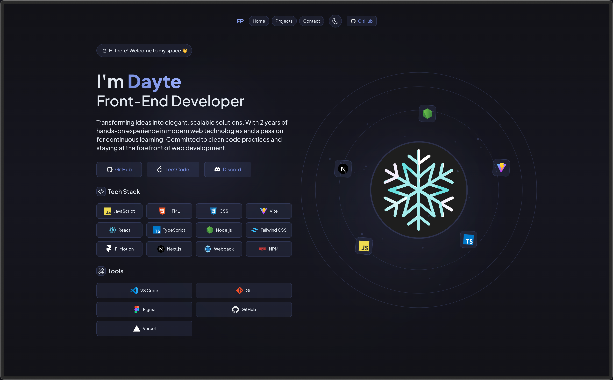
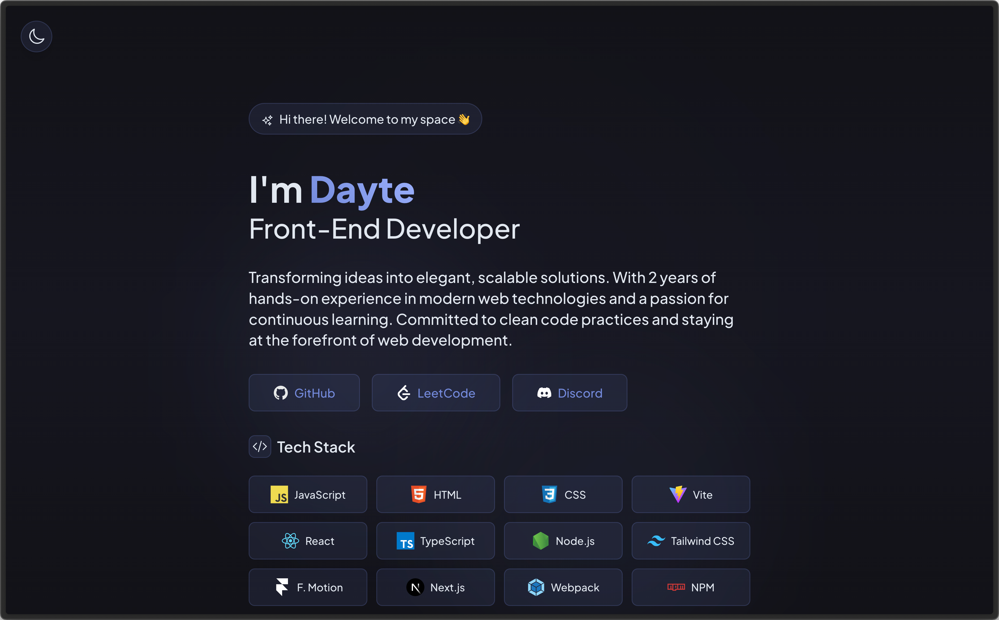

# Frozen Productions Portfolio

A modern, responsive portfolio website showcasing my projects and development journey. Built with cutting-edge web technologies and featuring a sleek glass-morphism design.

## 📱 Responsive Preview

  <h3>Desktop View (100% zoom)</h3>
  
   
  <em>Dark Theme</em>
    
  
   
  <em>Light Theme</em>
    
  
  <h3>Mobile View (150% zoom)</h3>
  
   
  <em>Dark Theme</em>
    
  
   
  <em>Light Theme</em>

## 🌐 Live Demo

🔗 [Visit Live Site](https://frozen.productions)

## ✨ Features

### Portfolio

-   **Glass Morphism UI**: Modern, translucent design with smooth gradients
-   **Interactive Elements**: Animated components with Framer Motion
-   **Responsive Design**: Optimized for all devices
-   **Project Showcase**: Filterable project gallery with live demos
-   **Dark Theme**: Beautiful dark mode with glowing accents

## 🛠 Tech Stack

-   **Framework**: React 18 with TypeScript
-   **Styling**: Tailwind CSS with custom glass morphism utilities
-   **Animations**: Framer Motion
-   **Build Tool**: Vite
-   **Icons**: Hero Icons
-   **Deployment**: Vercel
